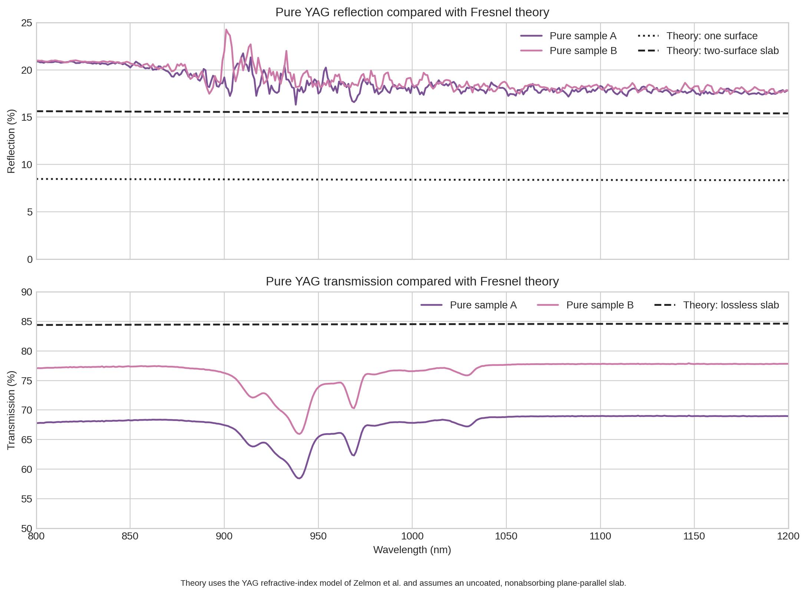
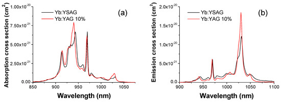

# Yb:YAG

[Reflection notebook](YbYAG_reflection.ipynb)

[Optical plotting script](scripts/plot_optical_spectra.py)

## Literature comparison

[Comparison script](scripts/compare_with_literature.py)

Published Yb:YAG absorption/emission spectrum:

The published 939.4 and 968.93 nm absorption peaks are unresolved in the broad high-absorbance plateau. The pure samples show more reflection and less transmission than an ideal uncoated, lossless YAG slab.

Figure 3 from [Pirri et al., Materials 11 (2018) 837](https://doi.org/10.3390/ma11050837), [CC BY 4.0](https://creativecommons.org/licenses/by/4.0/). YAG refractive index from [Zelmon et al., Applied Optics 37 (1998) 4933](https://doi.org/10.1364/AO.37.004933).
