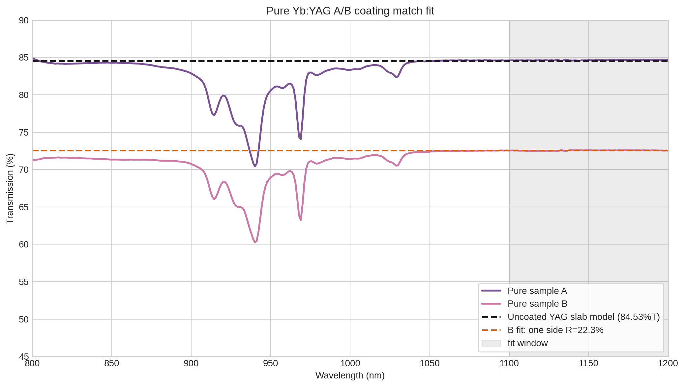

# Yb:YAG

[Reflection notebook](YbYAG_reflection.ipynb)

[Optical plotting script](scripts/plot_optical_spectra.py)

## Pure A/B coating fit

[Coating fit script](scripts/fit_pure_ab_coating.py)

Fit summary: [data/YbYAG_pure_A_B_coating_fit_summary.csv](data/YbYAG_pure_A_B_coating_fit_summary.csv).

Using the 1100-1200 nm baseline region, sample A matches an uncoated polished YAG slab. Sample B does not match a normal uncoated or AR-coated slab; the simplest optical fit is one bare YAG side plus one side with about 22.3% effective reflection/loss.

## Literature comparison

[Comparison script](scripts/compare_with_literature.py)

The published 939.4 and 968.93 nm absorption peaks are unresolved in the broad high-absorbance plateau.

Spectral positions from [Pirri et al., Materials 11 (2018) 837](https://doi.org/10.3390/ma11050837).

## Photoluminescence

[PL plotting script](scripts/plot_pl_spectra.py)

PL spectra for all Yb concentrations are shown on the same plot.

Full measured PL, reflection, and absorbance spectra on an aligned wavelength axis.
