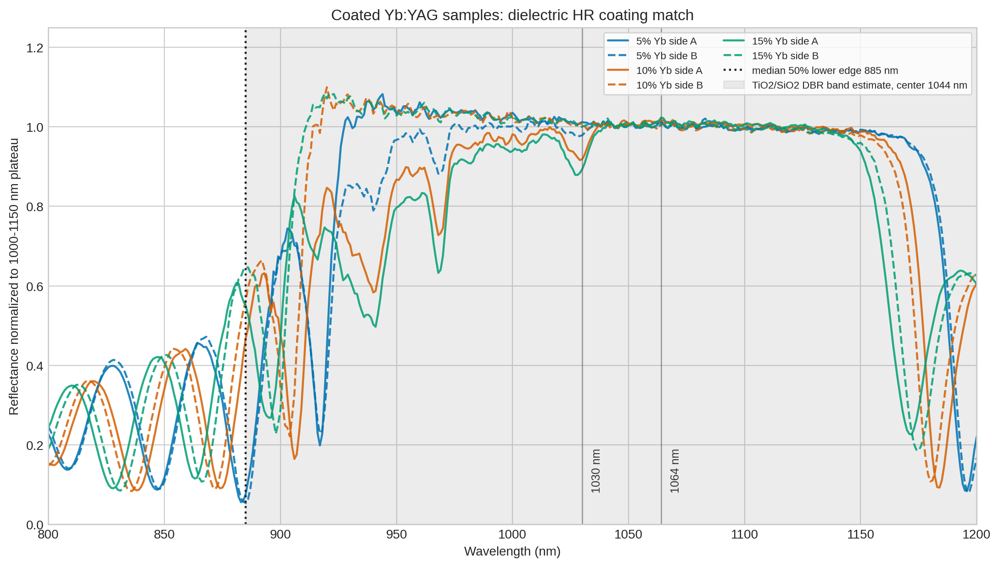

# Yb:YAG

[Reflection notebook](YbYAG_reflection.ipynb)

[Optical plotting script](scripts/plot_optical_spectra.py)

## Coated sample coating fit

[Coated sample coating fit script](scripts/fit_coated_sample_coatings.py)

Fit summary: [data/YbYAG_coated_sample_coating_match_summary.csv](data/YbYAG_coated_sample_coating_match_summary.csv). Candidate material ranking: [data/YbYAG_coated_sample_material_candidates.csv](data/YbYAG_coated_sample_material_candidates.csv).

The 5%, 10%, and 15% Yb coated samples have a high-reflection plateau through the 1.0-1.1 um laser region, with a lower stopband edge near 885 nm. The closest simple quarter-wave dielectric Bragg reflector match is TiO2/SiO2, followed by Nb2O5/SiO2. Ta2O5/SiO2 or HfO2/SiO2 would require a chirped or otherwise broadened stack to match the measured 800-1200 nm band.

## Literature comparison

[Comparison script](scripts/compare_with_literature.py)

The published 939.4 and 968.93 nm absorption peaks are unresolved in the broad high-absorbance plateau.

Spectral positions from [Pirri et al., Materials 11 (2018) 837](https://doi.org/10.3390/ma11050837).

## Photoluminescence

[PL plotting script](scripts/plot_pl_spectra.py)

PL spectra for all Yb concentrations are shown on the same plot.

Full measured PL, reflection, and absorbance spectra on an aligned wavelength axis.
