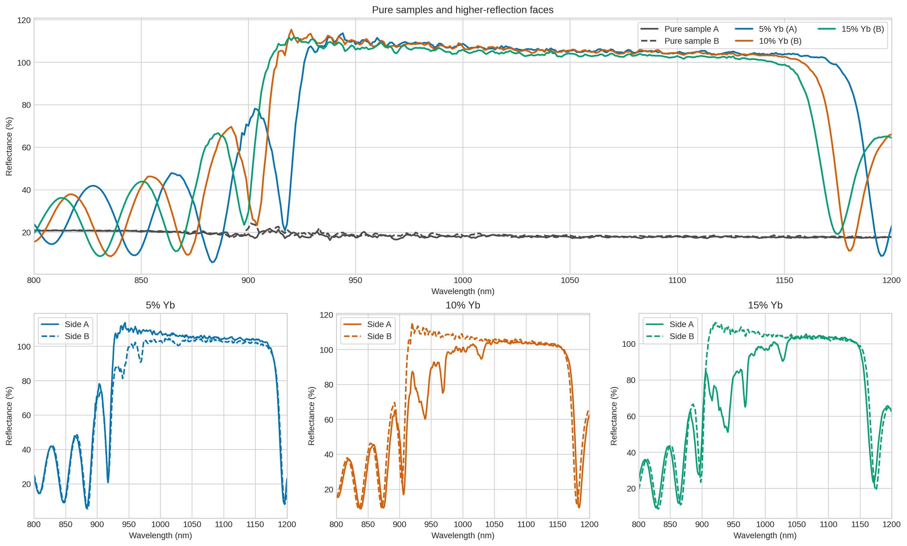
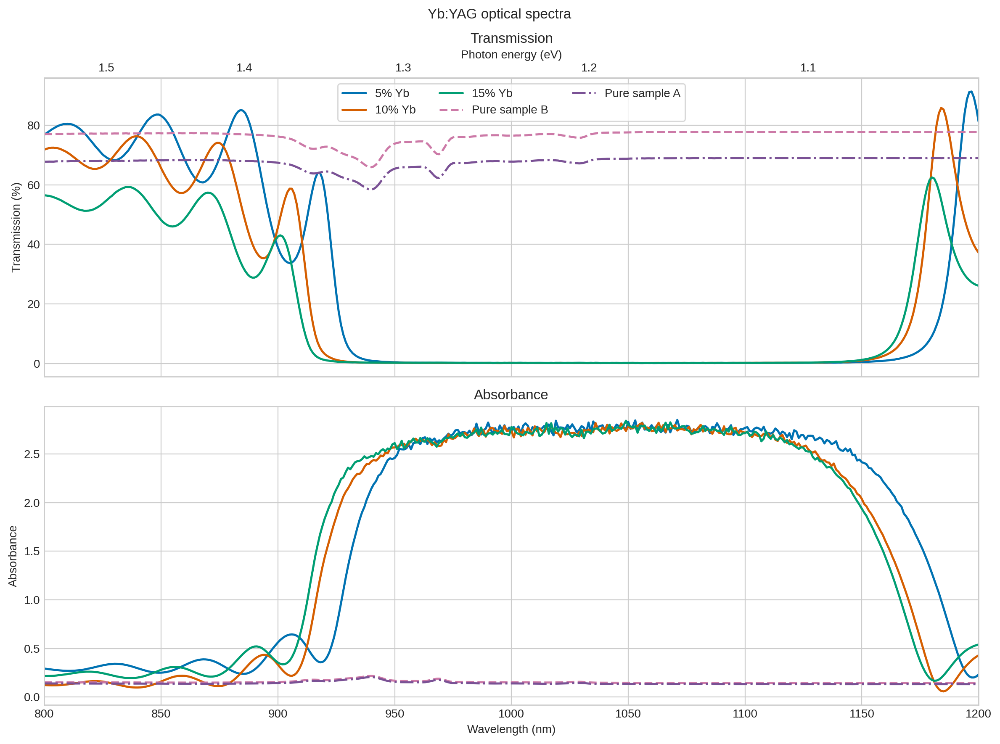
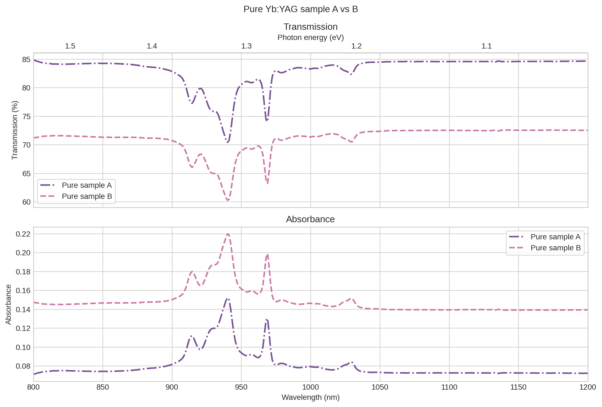
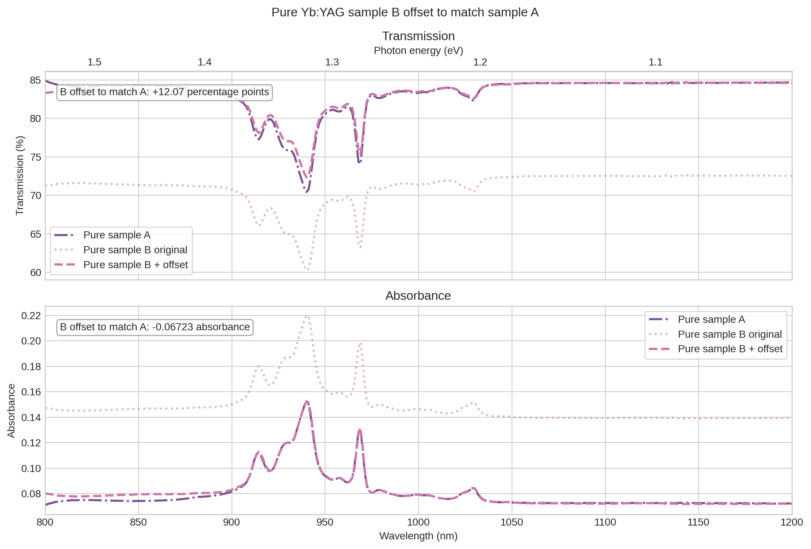
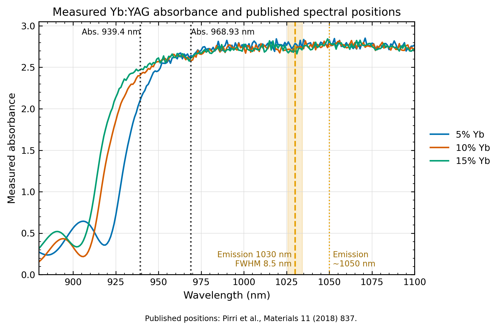
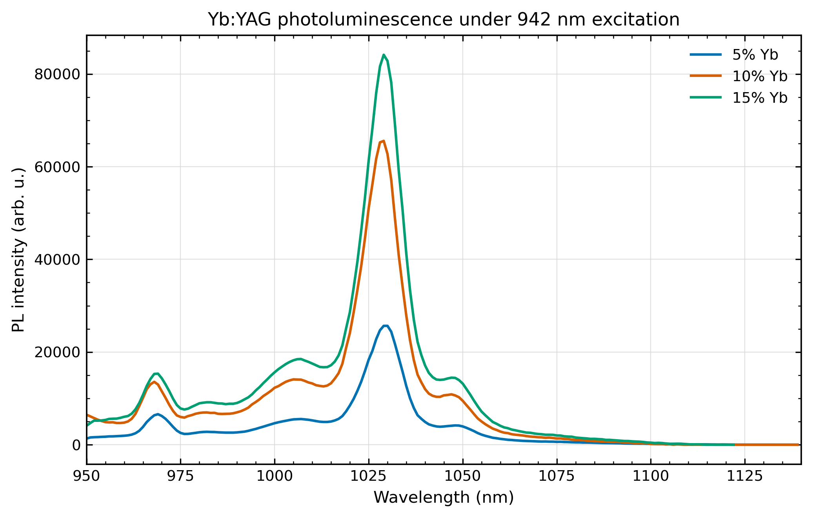
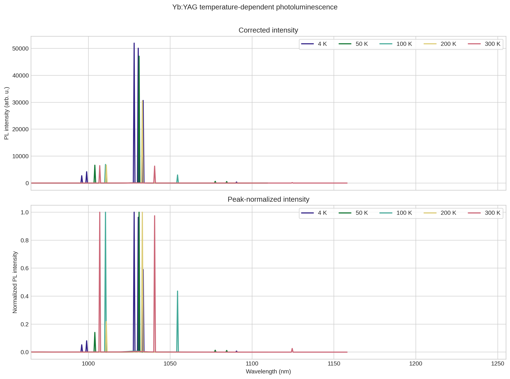
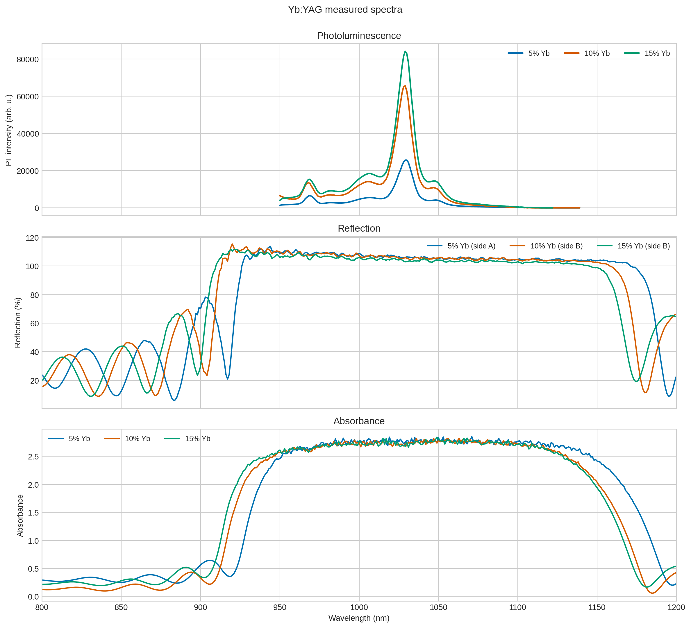

# Yb:YAG

[Reflection notebook](YbYAG_reflection.ipynb)

[Optical plotting script](scripts/plot_optical_spectra.py)

## Literature comparison

[Comparison script](scripts/compare_with_literature.py)

The published 939.4 and 968.93 nm absorption peaks are unresolved in the broad high-absorbance plateau.

Spectral positions from [Pirri et al., Materials 11 (2018) 837](https://doi.org/10.3390/ma11050837).

## Photoluminescence

[PL plotting script](scripts/plot_pl_spectra.py)

PL spectra for all Yb concentrations are shown on the same plot.

Temperature-dependent PL spectra are shown as corrected intensity and peak-normalized intensity.

Full measured PL, reflection, and absorbance spectra on an aligned wavelength axis.
