# Yb:YAG optical characterization

Experimental and modeling work on Yb:YAG active media, including transmission/reflection spectroscopy, photoluminescence, spectroscopic ellipsometry, dielectric-function modeling, and concentration inference.

## Current result — September 2026

The main current result is that the uncoated 1-mm `B` crystal should **not be assumed to be 5 at.% Yb**. Independent optical evidence is more consistent with approximately **1.5–2.5 at.%**, with the 941-nm and weak 1030-nm absorption both pointing close to **1.6–1.7 at.%**.

This is an optical inference; a direct composition measurement is still required.

Full analysis: [2026-09-17 optical-characterization checkpoint](results/2026-09-17_optical_characterization.md)

### 1. RC2 transmission quality control

The June-16 RC2 transmission run has the physically expected ~84% transparent baseline for uncoated YAG. Two June-18 runs sit near 59–60% and are consistent with a multiplicative throughput/alignment loss.

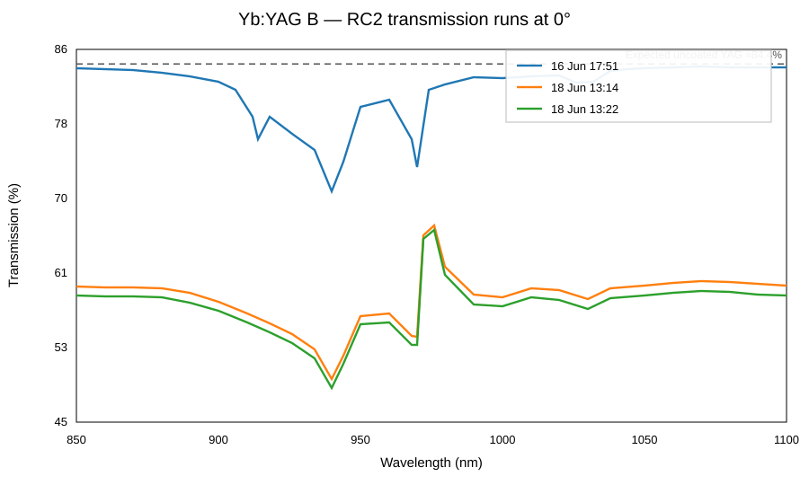

### 2. Current CompleteEASE B-spline

The current B-spline dielectric function reproduces the measured 915, 941, and 969 nm absorption bands well.

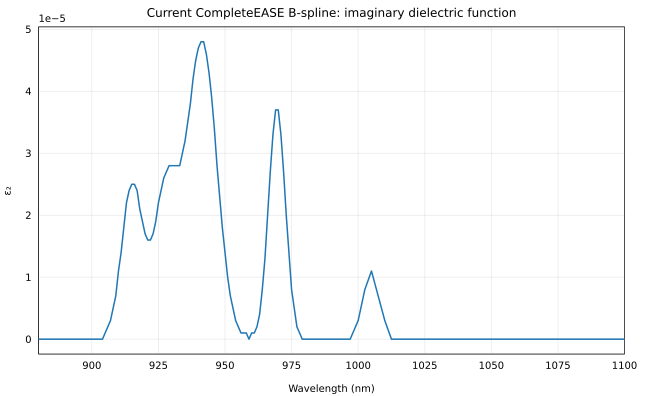

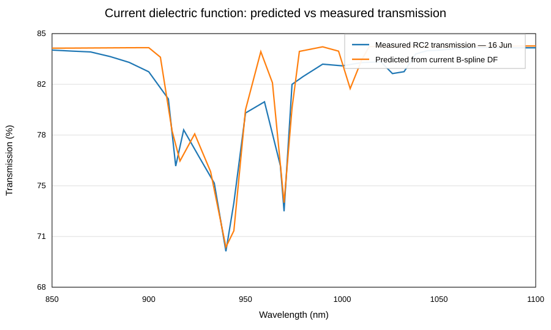

The main missing feature is weak ground-state reabsorption near 1030 nm, where the good transmission gives \(\alpha\approx0.25\ \mathrm{cm^{-1}}\) but the current B-spline drives \(\varepsilon_2\) to approximately zero.

### 3. Absorption cross section versus literature

Using a working concentration of 1.6 at.% gives very good agreement with the literature 941-nm cross section. The independent 1030-nm absorption also implies ~1.6 at.% when compared with published Yb:YAG cross-section data.

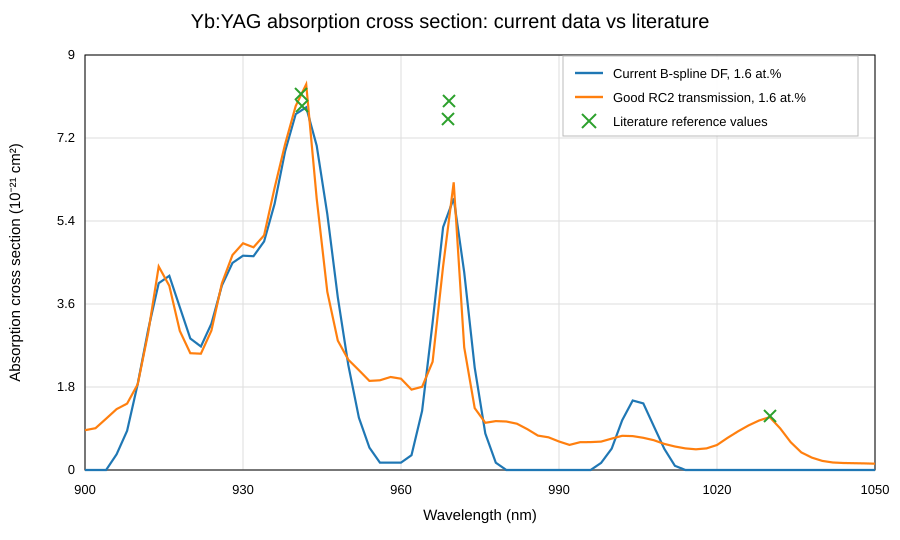

### 4. Independent concentration evidence

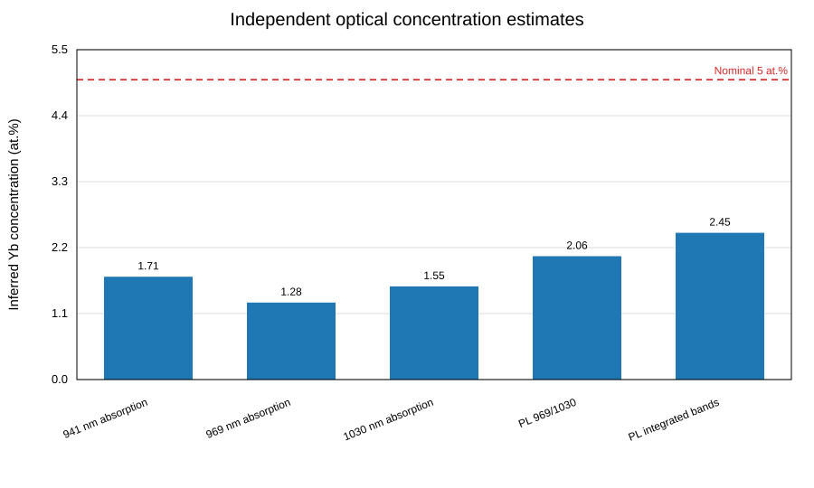

Current optical estimates:

- 941-nm absorption: ~1.7 at.%
- 1030-nm absorption: ~1.6 at.%
- 969-nm absorption: ~1.3 at.% (resolution-sensitive)
- PL \(I_{969}/I_{1030}\): ~2.1 at.% by crude extrapolation
- integrated PL bands: ~2.4 at.% by crude extrapolation

### 5. Photoluminescence

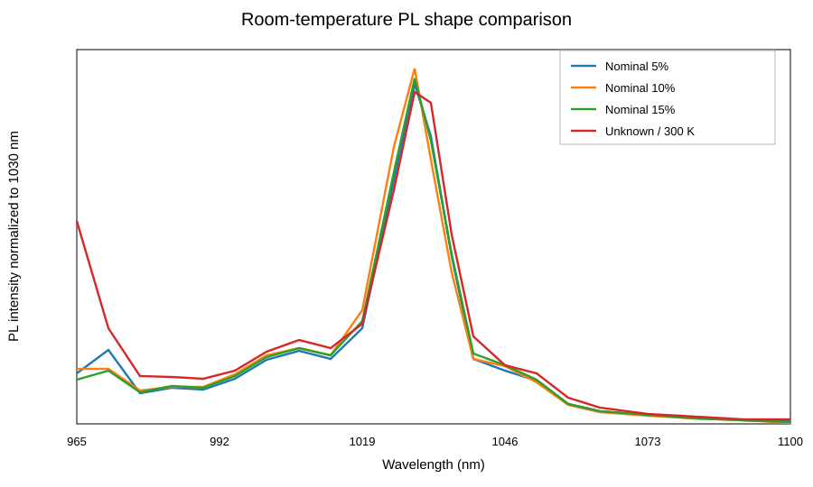

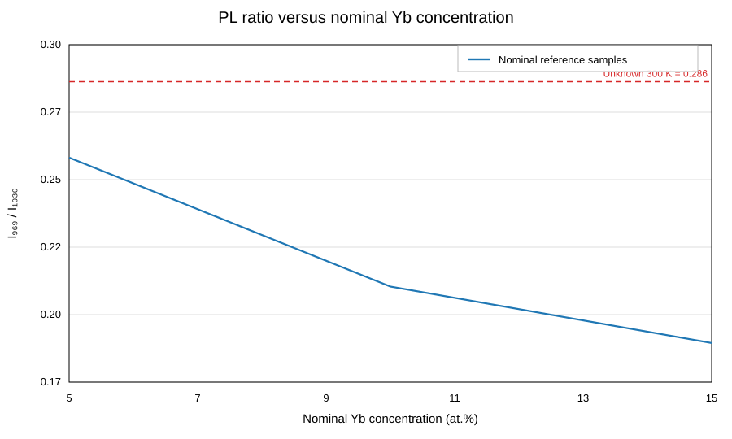

### 6. Coated nominal-5% comparison

The normalized difference between coated samples A and B follows the uncoated Yb absorption shape closely over 925–975 nm (correlation ~0.95), supporting the interpretation that the 941/969-nm depressions are Yb-related.

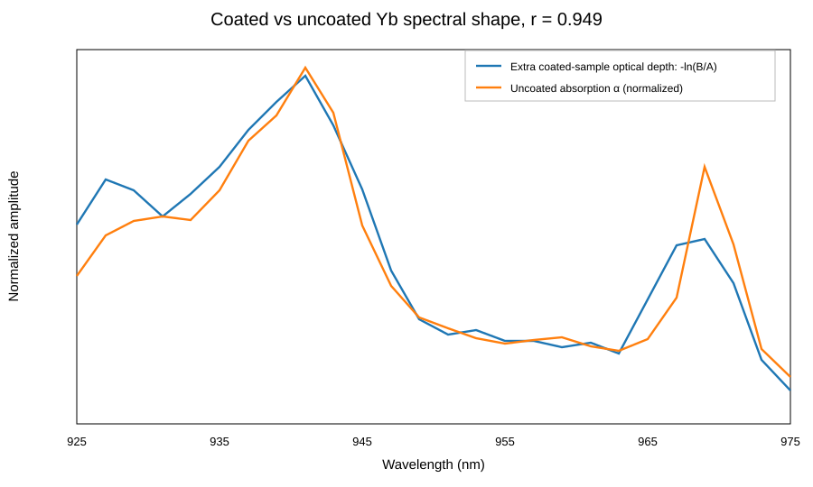

## Literature references used in the current analysis

Numerical values are collected in [`data/analysis_2026_09_17/literature_reference_values.csv`](data/analysis_2026_09_17/literature_reference_values.csv).

- Brown et al., *Yb:YAG Absorption at Ambient and Cryogenic Temperatures*, IEEE JSTQE 11, 604–612 (2005). [DOI](https://doi.org/10.1109/JSTQE.2005.850236)
- Liu et al., *Effects of the temperature dependence of absorption coefficients in edge-pumped Yb:YAG slab lasers*, JOSA B 24, 2081–2089 (2007). [DOI](https://doi.org/10.1364/JOSAB.24.002081)
- Körner et al., *Measurement of temperature-dependent absorption and emission spectra of Yb:YAG, Yb:LuAG, and Yb:CaF2 between 20 °C and 200 °C...*, JOSA B 29, 2493–2502 (2012). [DOI](https://doi.org/10.1364/JOSAB.29.002493)
- De Vido et al., *High-resolution absorption measurement at the zero phonon line of Yb:YAG between 80 K and 300 K*, Optical Materials Express 10, 717–723 (2020). [DOI](https://doi.org/10.1364/OME.386436)
- Pirri et al., *A Comprehensive Characterization of a 10 at.% Yb:YSAG Laser Ceramic Sample*, Materials 11, 837 (2018); includes a Yb:YAG comparison spectrum. [DOI](https://doi.org/10.3390/ma11050837)

The repository includes redrawn literature-comparison plots rather than copied publication figures.

## Existing optical spectra

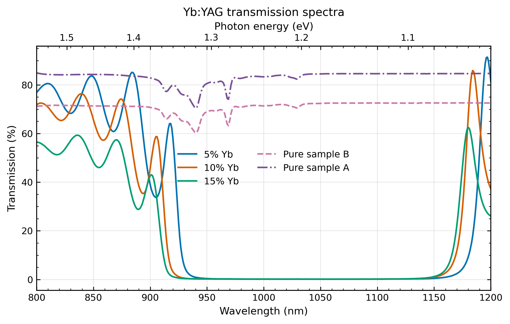

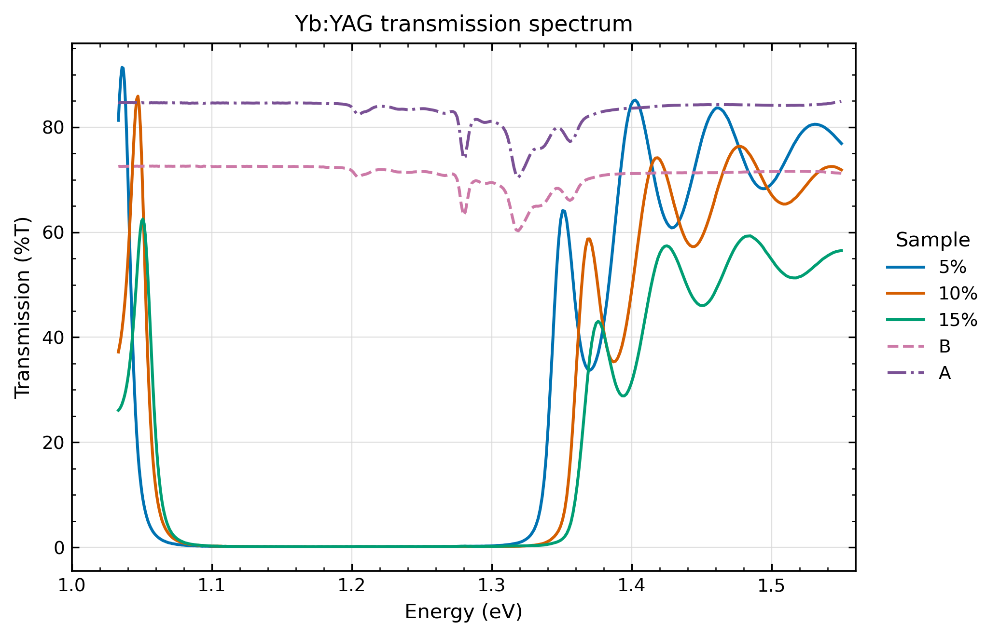

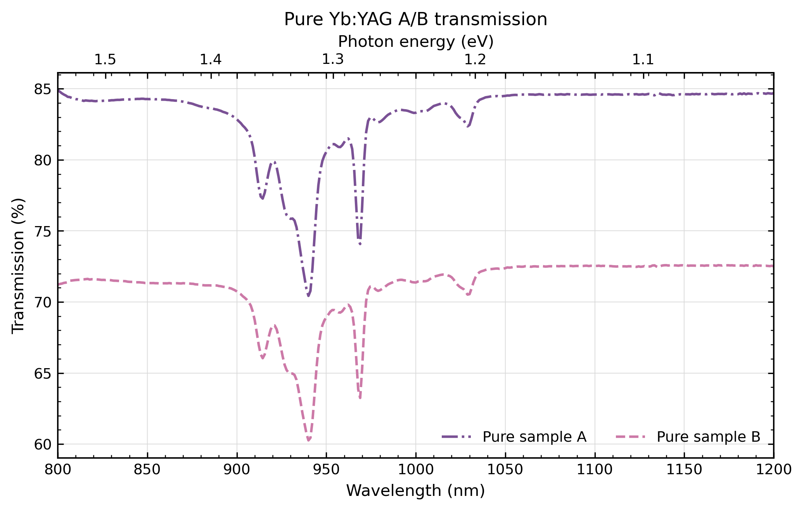

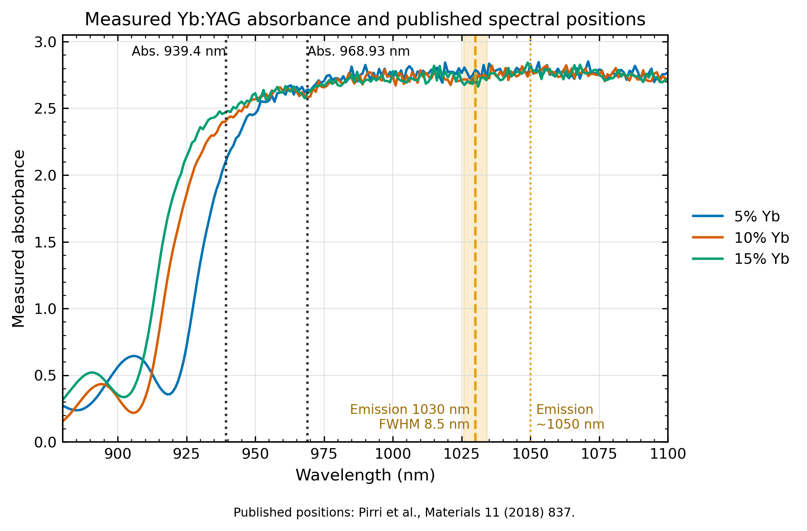

## Existing photoluminescence

Coated samples:

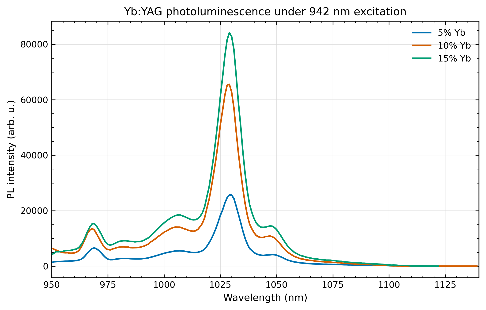

Temperature-dependent PL:

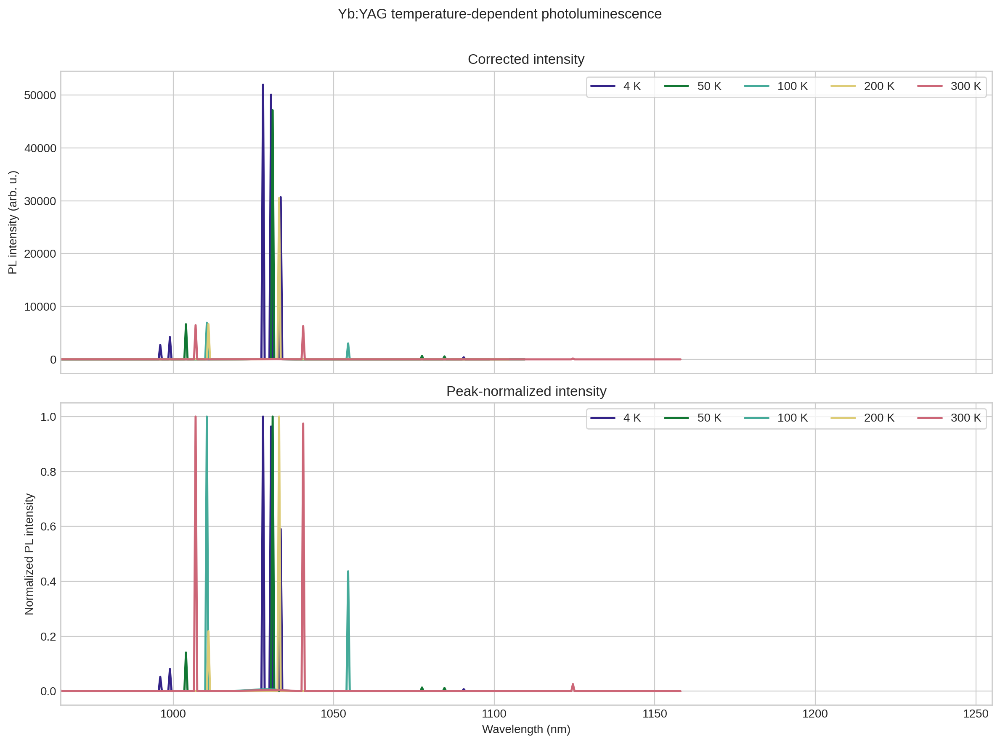
